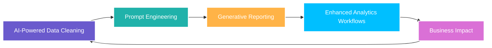

# 🏆 IBM Generative AI for Data Analysts Certification 🤖

Generative AI for Data Analysts Certification • [Verify Certificate](https://coursera.org/share/93f146fece144826163c12fb182733c1)

## 🌟 Overview

This certification provided hands-on experience with **Generative AI tools and techniques** tailored for data analysts. I learned to **enhance data analytics workflows**, automate report generation, and generate actionable insights using AI. The program emphasized practical applications of AI for **business growth, predictive analytics, and efficiency improvements**.

## 🚀 Key Skills Acquired

- **AI-Powered Data Cleaning:** Automate preprocessing and handle messy datasets efficiently.  
- **Prompt Engineering:** Craft effective AI prompts for generating accurate and relevant insights.  
- **Generative Reporting:** Produce automated dashboards, summaries, and narrative analytics.  
- **Enhanced Analytics Workflows:** Combine traditional data analysis with AI for faster insights.  
- **Business Impact:** Enable smarter decision-making, predictive insights, and improved reporting efficiency.

---
## 📚 Course Portfolio

### 🔹 1. Generative AI: Introduction and Applications

**Learnings:** Explored the fundamentals of Generative AI and its role in data analysis. Learned key concepts, AI model types, and applications in real-world business scenarios. Applied AI to automate repetitive data tasks and enhance analytical efficiency.  
**Verification:** [Verify Course](https://coursera.org/share/43797ddb63f07006118ae355a0079ca7)

### 🔹 2. Generative AI: Prompt Engineering Basics

**Learnings:** Developed expertise in crafting precise AI prompts to generate meaningful outputs. Learned strategies to optimize AI responses for analytics tasks, reporting, and predictive modeling. Applied prompt engineering to improve accuracy and reliability of AI-generated insights.  
**Verification:** [Verify Course](https://coursera.org/share/ed4bae35edf28ca24c6f70a235ade6d6)

### 🔹 3. Generative AI: Enhance your Data Analytics Career

**Learnings:** Applied Generative AI to enhance professional data analytics workflows. Learned to integrate AI tools into dashboards, reporting, and data storytelling. Explored AI-assisted insights for business decision-making, predictive trends, and operational efficiency. Completed projects simulating real-world analytics scenarios with AI augmentation.  
**Verification:** [Verify Course](https://coursera.org/share/83c10fe3151dfb34862275101a03f5d1)

---

## 💡 Business Applications

- **Automated Reporting:** Reduce manual effort by generating summaries and dashboards automatically.  
- **Predictive Analytics:** Use AI to identify trends, anomalies, and forecast future outcomes.  
- **Insight Generation:** Extract actionable insights from complex datasets efficiently.  
- **Decision Support:** Empower businesses to make faster, data-driven decisions using AI.

---

## 🌐 Wrap-Up

- **Skills Learned:** Generative AI, Prompt Engineering, AI-assisted Analytics, Automated Reporting  
- **Business Value:** Increase productivity, improve report accuracy, generate predictive insights, and enhance analytics career opportunities.  
- **Certification:** IBM Generative AI for Data Analysts ✅

