# IBM Data Analyst Professional Certificate 🚀

## 🎯 My IBM Data Analytics Journey

This comprehensive program equipped me with end-to-end data analysis skills using industry-standard tools. Through 11 hands-on courses, I mastered the complete data analytics workflow from data collection to visualization and storytelling.

**Verified at:** [https://coursera.org/share/7f654675f363ab2f620869706ef858d3](https://coursera.org/share/7f654675f363ab2f620869706ef858d3)

*Completed: September 12, 2025 • 11 Courses • 100+ Hours of Learning*

 

## 📊 What I have Learned

```mermaid
%%{init: {'theme': 'base', 'themeVariables': { 'primaryColor': '#FFDDC1', 'lineColor':'#FFFFFF', 'edgeLabelBackground':'#FFFFFF', 'tertiaryColor': '#fff'}}}%%
graph TD
    A[Skills I Have Gained] --> B[Programming]
    A --> C[Visualization]
    A --> D[Databases]
    A --> E[Tools]
    
    %% Programming
    B --> B1[Python]
    B --> B2[Pandas]
    B --> B3[NumPy]
    B --> B4[Jupyter]
    
    %% Visualization
    C --> C1[Excel Charts]
    C --> C2[Cognos Dashboards]
    C --> C3[Python Libraries]
    C --> C4[Interactive Reports]
    
    %% Databases
    D --> D1[SQL Queries]
    D --> D2[Database Design]
    D --> D3[Data Extraction]
    D --> D4[ETL Processes]
    
    %% Tools
    E --> E1[Excel Advanced]
    E --> E2[GitHub]
    E --> E3[AI Tools]
    E --> E4[Cloud Analytics]

    %% Define Colors
    classDef main fill:#FF6F61,stroke:#fff,stroke-width:2px,color:#fff;
    classDef programming fill:#6A5ACD,stroke:#fff,stroke-width:2px,color:#fff;
    classDef viz fill:#20B2AA,stroke:#fff,stroke-width:2px,color:#fff;
    classDef db fill:#FFB347,stroke:#fff,stroke-width:2px,color:#fff;
    classDef tools fill:#00BFFF,stroke:#fff,stroke-width:2px,color:#fff;

    %% Apply Classes
    class A main;
    class B,B1,B2,B3,B4 programming;
    class C,C1,C2,C3,C4 viz;
    class D,D1,D2,D3,D4 db;
    class E,E1,E2,E3,E4 tools;
```

## 📚 Course Portfolio with Descriptions :

### 🔹 1. Introduction to Data Analytics

**What I Mastered**: 
- Built comprehensive understanding of data analytics lifecycle and methodologies
- Learned to identify different data types and their appropriate use cases  
- Developed critical thinking for data-driven problem solving approaches
- **Learned**: Excel, Basic SQL 

**Verification**: [Verify Course](https://coursera.org/share/9f787f74d3acc421e48a2569e5d49680)

### 🔹 2. Excel Basics for Data Analysis

**What I Mastered**:
- Advanced Excel functions including VLOOKUP, INDEX-MATCH, and pivot tables
- Data cleaning techniques and automation using Excel formulas
- Created complex data models and performed what-if analysis scenarios
- **Learned**: Microsoft Excel, Power Query

**Verification**: [Verify Course](https://coursera.org/share/782598e69680bc2365f69c78c05bc953)

### 🔹 3. Data Visualization and Dashboards with Excel and Cognos

**What I Mastered**:
- Designed interactive business intelligence dashboards using Cognos Analytics
- Created advanced charts and visualizations for stakeholder presentations
- Implemented data storytelling techniques to communicate insights effectively
- **Learned**: Excel, IBM Cognos

**Verification**: [Verify Course](https://coursera.org/share/9d66eb4260556cda2037d82606f4ed3a)

### 🔹 4. Python for Data Science, AI & Development

**What I Mastered**:
- Python programming fundamentals including data structures and functions
- Object-oriented programming concepts for scalable data applications
- Integrated Python with Jupyter notebooks for reproducible data analysis
- **Learned**: Python 3, Jupyter Notebooks

**Verification**: [Verify Course](https://coursera.org/share/a94bcac9a40cf2770b57a53babd1b8a6)

### 🔹 5. Python Project for Data Science

**What I Mastered**:
- Applied web scraping techniques to collect real-world data from APIs
- Performed data wrangling and cleaning using Pandas library extensively
- Created an end-to-end data analysis project with documented methodology
- **Learned**: Pandas, Web APIs, Data Cleaning

**Verification**: [Verify Course](https://coursera.org/share/f707c2612f15b1db90bba1523c8da55a)

### 🔹 6. Databases and SQL for Data Science with Python

**What I Mastered**:
- Designed and implemented relational database schemas for optimal performance
- Wrote complex SQL queries including joins, subqueries, and window functions
- Integrated Python with databases for automated data extraction and loading
- **Learned**: SQL, MySQL, Python DB Integration

**Verification**: [Verify Course](https://coursera.org/share/1387bdd10f4ed23f70f8644d6b51133f)

### 🔹 7. Data Analysis with Python

**What I Mastered**:
- Performed statistical analysis and hypothesis testing using Python libraries
- Implemented machine learning algorithms for predictive analytics
- Conducted exploratory data analysis (EDA) on complex datasets
- **Learned**: NumPy, SciPy, Scikit-learn

**Verification**: [Verify Course](https://coursera.org/share/71f35dd87aba3f1623c5a4f38313fd97)

### 🔹 8. Data Visualization with Python

**What I Mastered**:
- Created interactive visualizations using Plotly and Dash frameworks
- Designed publication-quality charts with Matplotlib and Seaborn
- Built interactive web dashboards for real-time data presentation
- **Learned**: Matplotlib, Seaborn, Plotly

**Verification**: [Verify Course](https://coursera.org/share/fc84efa67ef4a4d694a8a9a48320eead)

### 🔹 9. IBM Data Analyst Capstone Project

**What I Mastered**:
- Executed complete data analysis project from requirements to presentation
- Synthesized skills across Python, SQL, Excel, and visualization tools
- Delivered actionable business insights with measurable impact recommendations
- **Learned**: Full Stack Analytics

**Verification**: [Verify Course](https://coursera.org/share/9ceaf5ffb2ede8d526ad21918d5d9ed2)

### 🔹 10. Generative AI: Enhance your Data Analytics Career

**What I Mastered**:
- Leveraged AI tools for automated data cleaning and preprocessing
- Used generative AI for creating data analysis reports and documentation
- Implemented AI-assisted data interpretation and insight generation
- **Learned**: AI Analytics Tools, Prompt Engineering

**Verification**: [Verify Course](https://coursera.org/share/83c10fe3151dfb34862275101a03f5d1)

### 🔹 11. Data Analyst Career Guide and Interview Preparation

**What I Mastered**:
- Developed portfolio-ready projects showcasing end-to-end analytics skills
- Prepared for technical interviews with data analysis case studies
- Created professional resume highlighting quantifiable achievements
- **Learned**: Portfolio Development, Interview Prep

**Verification**: [Verify Course](https://coursera.org/share/19f5324b2b04974cdb5c3aad02a73adb)

