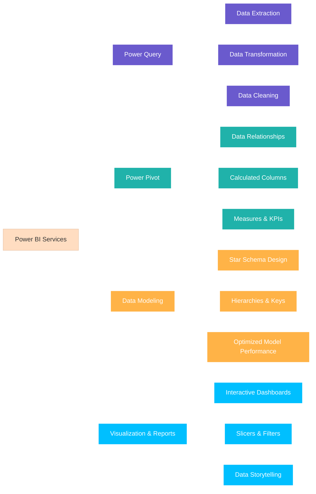

# 🏆 Microsoft Power BI Data Analyst Certification 🎯
## 🚀 My Power BI Skills Journey :

**Microsoft Power BI Data Analyst Certificate**      [✅Certificate Verification](https://coursera.org/share/dd5f63c494cd12840b933117b1f17faa)

🌟 This certification empowered me to transform raw data into **actionable insights** using **Power BI, Excel, and DAX**. I mastered end-to-end workflows including data preparation, modeling, visualization, and deployment. With these skills, I can design dashboards that communicate complex insights clearly and drive measurable business growth.

---

## 🎓 Courses & Detailed Descriptions

### 📊 1. Preparing Data for Analysis with Microsoft Excel

🔹 **Learnings:** Developed strong Excel skills to clean, transform, and structure raw datasets. Learned advanced formulas, conditional formatting, and pivot tables to summarize large datasets efficiently. Applied best practices for preparing data to ensure it is analysis-ready for Power BI integration. Learned how to handle inconsistencies, missing values, and perform quality checks, building a foundation for professional data analysis.  
🔗 **Verification:** [Verify Course](https://coursera.org/share/66cf1dfc3de2929f0734f51eb3853f6d)
 
### 💻 2. Harnessing the Power of Data with Power BI

🔹 **Learnings:** Gained hands-on experience with Power BI Desktop and Service. Learned to connect multiple data sources including Excel, CSV, and SQL databases. Designed dynamic, interactive reports and dashboards for decision-making. Focused on data storytelling and visualization principles to highlight business insights effectively. Explored real-world scenarios like sales, finance, and marketing analytics to strengthen practical application.  
🔗 **Verification:** [Verify Course](https://coursera.org/share/a8003d070c24f222c82c94f5b797b5a7)
 
### 🔄 3. Extract, Transform and Load Data in Power BI

🔹 **Learnings:** Mastered ETL processes in Power BI using Power Query. Learned to extract data from diverse sources, transform it using advanced cleaning and transformation techniques, and load it efficiently into the model. Automated refresh schedules for continuous reporting. Gained expertise in data shaping, merging, and creating reusable query templates, enabling faster, error-free reporting.  
🔗 **Verification:** [Verify Course](https://coursera.org/share/b2df4a06bb86129c1a50dee98a216458)
 
### 🏗️ 4. Data Modeling in Power BI

🔹 **Learnings:** Learned to design scalable and optimized data models for reporting. Implemented table relationships, hierarchies, and star schema design. Mastered DAX formulas for calculated columns, measures, and KPIs. Learned to balance model performance and analytical flexibility to provide business-ready insights. Applied best practices for handling large datasets efficiently and ensuring consistency in metrics across reports.  
🔗 **Verification:** [Verify Course](https://coursera.org/share/5230c34cd46a710ce573246f2a4442e9)
 
### 📊 5. Data Analysis and Visualization with Power BI

🔹 **Learnings:** Built professional, interactive dashboards using charts, tables, KPIs, and slicers. Applied advanced visualization techniques to communicate insights effectively. Conducted exploratory data analysis (EDA) to uncover patterns, trends, and anomalies. Learned storytelling with data to present actionable recommendations. Developed multi-page reports with drill-through and interactive features to facilitate decision-making.  
🔗 **Verification:** [Verify Course](https://coursera.org/share/16161118d08124465a3f476bd39962de)
 
### 🎨 6. Creative Designing in Power BI

🔹 **Learnings:** Focused on enhancing report usability and aesthetics. Learned to apply themes, color palettes, custom visuals, and layout principles for professional dashboards. Optimized dashboards for readability, accessibility, and mobile responsiveness. Learned to balance creativity and clarity, turning complex datasets into visually engaging, intuitive reports for business stakeholders.  
🔗 **Verification:** [Verify Course](https://coursera.org/share/11032b62c04897532d44f3c5f27bed5b)
 
### 🚀 7. Deploy and Maintain Power BI Assets and Capstone Project

🔹 **Learnings:** Learned to publish dashboards and reports to Power BI Service with proper security and sharing configurations. Managed workspaces, scheduled refreshes, and monitored performance. Completed a capstone project integrating multiple datasets and applying all learned skills to solve a real-world business problem. Delivered actionable insights that could influence strategic decisions in a simulated enterprise scenario.  
🔗 **Verification:** [Verify Course](https://coursera.org/share/c6335891c7d7de61e2adec709149e866)
 
### 🏆 8. Microsoft PL-300 Exam Preparation and Practice

🔹 **Learnings:** Reviewed all core concepts of Power BI for the official PL-300 exam. Practiced real-world scenarios covering data preparation, modeling, visualization, and deployment. Tested knowledge with practical exercises, case studies, and mock exams. Gained confidence and readiness to achieve Microsoft certification and demonstrate professional proficiency as a Power BI Data Analyst.  
🔗 **Verification:** [Verify Course](https://coursera.org/share/a7f54f547f57635bd77d798fac4fa85f)

---

## 🌟 Wrap-Up

- **Skills Learned:** Excel, Power BI Desktop & Service, DAX, ETL, Data Modeling, Interactive Dashboards, Report Automation  
- **Business Value:** Enable organizations to make faster, smarter, and data-driven decisions. Improve reporting efficiency, uncover actionable insights, and support strategic planning.  

---

## ⚡ What i have learned through POWER BI :

## 🔗 Connect with Me
**💼 Nij Hingrajiiya**  
- 📍 London  
- 📧 nijhingrajiya40@gmail.com  
- 🌐 [My interactive Portfolio projects](https://www.novypro.com/profile_about/nij-hingrajiya)
